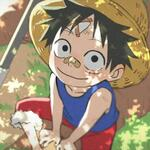

# CTF-Writeups
This is a repository of writeups for various jeopardy challenges from CTFs that I have participated starting from 2021 to 2022. *Capture The Flag* is a type of computer security or hacking competition that generally involves breaking, investigating and reverse engineering a computer system to hunt for a *flag*, which is usually a specific string of text.

### Team x0rry
|     |  |  |
|:-----------------------------------------------:|:-----------------------------------------------:|:-----------------------------------------------:|
| **JesusCries**                                  | **pikaroot**                                    | **redeeF**                                      |

### Overview
| CTF Name           | Link                                                         |
|--------------------|--------------------------------------------------------------|
| Battle of Hackers  | [2021](BoH2021) |
| Hack@10            | [2021](HACK@10) |
| HTB Santa          | [2021](HTB%20Santa%202021) |
| HTB UniCTF         | [2022](HTB%20UniCTF%202022) |
| SKR CTF            | [2021](SKR%20CTF) |
| TARUC CTF          | [2021](TARUC%20CTF%20Season%201) |
| WinRaRCTF          | [2021](WinRaRCTF) |
| corCTF             | [2021](corCTF) [2022](corCTF) |
| APU iCTF           | [2022](iCTF%202022) |
| iHack              | [2022](iHack2022%20Qualifying%20Round) |
