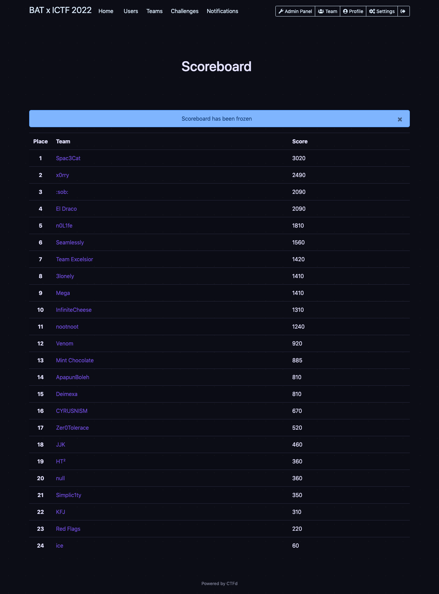

# APU X BAT iCTF 2022

## Challenge List
| Name                                            | Category             | Tags                                        | Difficulty  | Writeup  |
|:-----------------------------------------------:|:--------------------:|:-------------------------------------------:|:-----------:|:--------:|
| [binexp-0](pwn/binexp-0)                        | Binary Exploitation  | Variable Overwrite                          | ★☆☆☆☆    | ✅       |
| [binexp-1](pwn/binexp-1)                        | Binary Exploitation  | ret2win                                     | ★☆☆☆☆    | ✅       |
| [binexp-2](pwn/binexp-2)                        | Binary Exploitation  | ret2win With Parameters                     | ★☆☆☆☆    | ✅       |
| [EZ1](rev/EZ1)                                  | Reverse Engineering  | XOR                                         | ★☆☆☆☆    | ✅       |
| [EZ2](rev/EZ2)                                  | Reverse Engineering  | N/A                                         | ★☆☆☆☆    | ⬜       |
| [F0rg0tt3nCr3d3nt14l5](rev/F0rg0tt3nCr3d3nt14l5)| Reverse Engineering  | Static Analysis                             | ★☆☆☆☆    | ✅       |
| [Randomness](rev/Randomness)                    | Reverse Engineering  | ASLR, Dynamic Analysis                      | ★☆☆☆☆    | ✅       |

## Scoreboard

