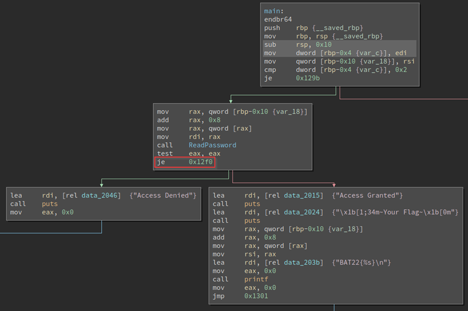
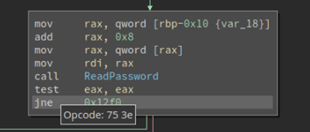
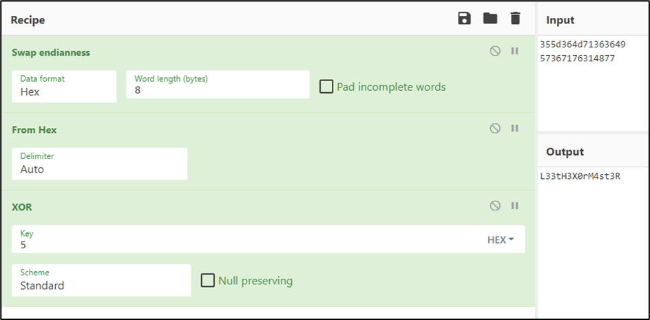

# EZ1

> **Description:** There is a flag inside this binary.

### Basic File Checks

After downloading the file, check the file type and its data to get an overall idea about the characteristics and architecture that we are dealing with.

```
┌──(kali💀JesusCries)-[~/Desktop]
└─$ file EZ1  
EZ1: ELF 64-bit LSB pie executable, x86-64, version 1 (SYSV), dynamically linked, interpreter /lib64/ld-linux-x86-64.so.2, BuildID[sha1]=ea97338bc60756d615a717f8138e3e99f2f2b05f, for GNU/Linux 3.2.0, not stripped
```

From the command above, some of the major takeaways are:

- ELF File Type.

- 64-bit.
- Least Significant Bit (LSB) executable.
- Functions name not stripped.

Using the `strings` utility, we can find and print out text strings embedded in the binary.

```
┌──(kali💀JesusCries)-[~/Desktop]
└─$ strings EZ1 
/lib64/ld-linux-x86-64.so.2
libc.so.6
puts
__stack_chk_fail
printf
strlen
__cxa_finalize
__libc_start_main
GLIBC_2.4
GLIBC_2.2.5
_ITM_deregisterTMCloneTable
__gmon_start__
_ITM_registerTMCloneTable
u+UH
I66qM6]5H
wH1vq6W
dH34%(
[]A\A]A^A_
Need 1 Argument.
Access Granted
[1;34m~Your Flag~
BAT22{%s}
Access Denied
:*3$"
```

However, no obvious result is returned. This suggest that the flag is either not hard coded in the binary or it is intentionally hidden from strings to prevent EZ wins.

Using `ltrace` and `strace` utilities, we can attempt to carve for leaked flag during any function or syscalls such as `strcmp`.

```
┌──(kali💀JesusCries)-[~/Desktop]
└─$ ltrace ./EZ1 test
Access Denied
+++ exited (status 0) +++
                                                                                                                                                                                       
┌──(kali💀JesusCries)-[~/Desktop]
└─$ strace ./EZ1 test
execve("./EZ1", ["./EZ1", "test"], 0x7ffceef282b8 /* 55 vars */) = 0
brk(NULL)                               = 0x55f9fd26f000
access("/etc/ld.so.preload", R_OK)      = -1 ENOENT (No such file or directory)
openat(AT_FDCWD, "/etc/ld.so.cache", O_RDONLY|O_CLOEXEC) = 3
newfstatat(3, "", {st_mode=S_IFREG|0644, st_size=95047, ...}, AT_EMPTY_PATH) = 0
mmap(NULL, 95047, PROT_READ, MAP_PRIVATE, 3, 0) = 0x7f8c66034000
close(3)                                = 0
openat(AT_FDCWD, "/lib/x86_64-linux-gnu/libc.so.6", O_RDONLY|O_CLOEXEC) = 3
read(3, "\177ELF\2\1\1\3\0\0\0\0\0\0\0\0\3\0>\0\1\0\0\0`9\2\0\0\0\0\0"..., 832) = 832
pread64(3, "\6\0\0\0\4\0\0\0@\0\0\0\0\0\0\0@\0\0\0\0\0\0\0@\0\0\0\0\0\0\0"..., 784, 64) = 784
pread64(3, "\4\0\0\0\20\0\0\0\5\0\0\0GNU\0\2\200\0\300\4\0\0\0\1\0\0\0\0\0\0\0", 32, 848) = 32
pread64(3, "\4\0\0\0\24\0\0\0\3\0\0\0GNU\0\27\n\3\204\346\353\257Q\2\31\305\316\347\315F\250"..., 68, 880) = 68
newfstatat(3, "", {st_mode=S_IFREG|0755, st_size=1900960, ...}, AT_EMPTY_PATH) = 0
mmap(NULL, 8192, PROT_READ|PROT_WRITE, MAP_PRIVATE|MAP_ANONYMOUS, -1, 0) = 0x7f8c66032000
pread64(3, "\6\0\0\0\4\0\0\0@\0\0\0\0\0\0\0@\0\0\0\0\0\0\0@\0\0\0\0\0\0\0"..., 784, 64) = 784
mmap(NULL, 1934632, PROT_READ, MAP_PRIVATE|MAP_DENYWRITE, 3, 0) = 0x7f8c65e59000
mmap(0x7f8c65e7b000, 1409024, PROT_READ|PROT_EXEC, MAP_PRIVATE|MAP_FIXED|MAP_DENYWRITE, 3, 0x22000) = 0x7f8c65e7b000
mmap(0x7f8c65fd3000, 327680, PROT_READ, MAP_PRIVATE|MAP_FIXED|MAP_DENYWRITE, 3, 0x17a000) = 0x7f8c65fd3000
mmap(0x7f8c66023000, 24576, PROT_READ|PROT_WRITE, MAP_PRIVATE|MAP_FIXED|MAP_DENYWRITE, 3, 0x1c9000) = 0x7f8c66023000
mmap(0x7f8c66029000, 34088, PROT_READ|PROT_WRITE, MAP_PRIVATE|MAP_FIXED|MAP_ANONYMOUS, -1, 0) = 0x7f8c66029000
close(3)                                = 0
mmap(NULL, 8192, PROT_READ|PROT_WRITE, MAP_PRIVATE|MAP_ANONYMOUS, -1, 0) = 0x7f8c65e57000
arch_prctl(ARCH_SET_FS, 0x7f8c66033580) = 0
mprotect(0x7f8c66023000, 16384, PROT_READ) = 0
mprotect(0x55f9fb592000, 4096, PROT_READ) = 0
mprotect(0x7f8c6607b000, 8192, PROT_READ) = 0
munmap(0x7f8c66034000, 95047)           = 0
newfstatat(1, "", {st_mode=S_IFCHR|0600, st_rdev=makedev(0x88, 0), ...}, AT_EMPTY_PATH) = 0
brk(NULL)                               = 0x55f9fd26f000
brk(0x55f9fd290000)                     = 0x55f9fd290000
write(1, "Access Denied\n", 14Access Denied
)         = 14
exit_group(0)                           = ?
+++ exited with 0 +++
```

Nothing interesting as well.

### Static Analysis with Ghidra + Patching with BinaryNinja

Disassemble the binary using `Ghidra` and look for the `main` function.

```c
undefined8 main(int param_1,long param_2)

{
  int iVar1;
  undefined8 uVar2;
  
  if (param_1 == 2) {
    iVar1 = ReadPassword(*(undefined8 *)(param_2 + 8));
    if (iVar1 == 0) {
      puts("Access Denied");
      uVar2 = 0;
    }
    else {
      puts("Access Granted");
      puts("\x1b[1;34m~Your Flag~\x1b[0m");
      printf("BAT22{%s}\n",*(undefined8 *)(param_2 + 8));
      uVar2 = 0;
    }
  }
  else {
    puts("Need 1 Argument.");
    uVar2 = 0xffffffff;
  }
  return uVar2;
}
```

First thing that came into my mind was to patch the instruction that checks whether if  `iVar1 == 0`. If we can invert the if statement’s logic, we can possibly bypass the `ReadPassword` function and get the flag straight away!

Using the disassembly graph in `BinaryNinja`, we can determine the instruction that is responsible for the conditional branch. 



To bypass the `ReadPassword` function, we need to invert/patch the logic from `JE` to `JNE`. This will change the instruction opcode.



After patching, save the ELF file as a new executable and run the program. Validation is bypassed, but still no flag since the program is designed to be a flag-checker.

```
┌──(kali💀JesusCries)-[~/Desktop]
└─$ ./patched test_flag
Access Granted
~Your Flag~
BAT22{test_flag}
```
### Intended Solution

In the `ReadPassword` function. We can see that the hardcoded flag is located from`local_28` to`local_20` and XORed by `5` in a loop.

```c
undefined8 ReadPassword(char *param_1)

{
  size_t sVar1;
  undefined8 uVar2;
  long in_FS_OFFSET;
  int local_2c;
  undefined8 local_28;
  undefined8 local_20;
  long local_10;
  
  local_10 = *(long *)(in_FS_OFFSET + 0x28);
  local_28 = 0x355d364d71363649;
  local_20 = 0x57367176314877;
  local_2c = 0;
  sVar1 = strlen(param_1);
  if (sVar1 == 0xf) {
    do {
      if ((*(byte *)((long)&local_28 + (long)local_2c) ^ 5) != param_1[local_2c]) {
        uVar2 = 0;
        goto LAB_00101259;
      }
      local_2c = local_2c + 1;
    } while ((*(char *)((long)&local_28 + (long)local_2c) != '\0') && (param_1[local_2c] != '\0'));
    uVar2 = 1;
  }
  else {
    uVar2 = 0;
  }
LAB_00101259:
  if (local_10 != *(long *)(in_FS_OFFSET + 0x28)) {
                    /* WARNING: Subroutine does not return */
    __stack_chk_fail();
  }
  return uVar2;
}
```

Decode the flag using `CyberChef` by decrypting the flag with `5` as the key.



```
┌──(kali💀JesusCries)-[~/Desktop]
└─$ ./EZ1 L33tH3X0rM4st3R                                                                                  
Access Granted
~Your Flag~
BAT22{L33tH3X0rM4st3R}
```

**Flag:** `BAT22{L33tH3X0rM4st3R}`
