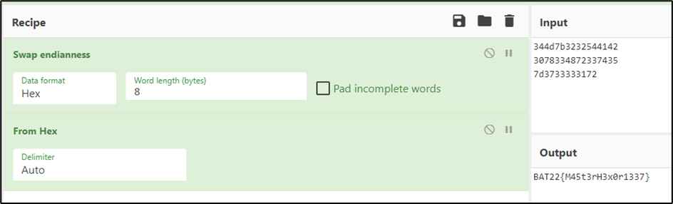

# **F0rg0tt3nCr3d3nt14l5**   

> **Description:** I saved the flag inside my account; the problem is I forgot my credentials…

### Basic File Checks

After downloading the file, check the file type and its data to get an overall idea about the characteristics and architecture that we are dealing with.

```
┌──(kali💀JesusCries)-[~/Desktop]
└─$ file F0rg0tt3nCr3d3nt14l5 
F0rg0tt3nCr3d3nt14l5: ELF 64-bit LSB pie executable, x86-64, version 1 (SYSV), dynamically linked, interpreter /lib64/ld-linux-x86-64.so.2, BuildID[sha1]=5588c48d94c00707c4b60eccb5353c91fb303de6, for GNU/Linux 3.2.0, not stripped
```

From the command above, some of the major takeaways are:

- ELF File Type.

- 64-bit.
- Least Significant Bit (LSB) executable.
- Functions name not stripped.

Using the `strings` utility, we can find and print out text strings embedded in the binary.

```
┌──(kali💀JesusCries)-[~/Desktop]
└─$ strings F0rg0tt3nCr3d3nt14l5    
/lib64/ld-linux-x86-64.so.2
libc.so.6
__isoc99_scanf
puts
__stack_chk_fail
putchar
printf
strlen
atoi
__cxa_finalize
strcmp
__libc_start_main
GLIBC_2.7
GLIBC_2.4
GLIBC_2.2.5
_ITM_deregisterTMCloneTable
__gmon_start__
_ITM_registerTMCloneTable
u+UH
BAT22{M4H
5t3rH3x0H
r1337}
BAU00
1v3xA;
w5016}
dH34%(
[]A\A]A^A_
Enter Username: 
Enter Password: 
Admin
Correct, Here is your Flag: 
Incorrect Password
Incorrect Username
:*3$"
```

We managed to carve the flag out of the binary using this method. However, upon submitting, the flag was rejected. This is because there are some junk characters in between the flag characters.

### Static Analysis with Ghidra

Disassemble the binary using `Ghidra` and look for the `main` function. The main function is the entry point of a program where instruction execution begins. Therefore, we can first begin our static code analysis from this part.

```c
undefined8 main(void)

{
  int iVar1;
  undefined8 uVar2;
  long in_FS_OFFSET;
  char local_48 [32];
  char local_28 [24];
  long local_10;
  
  local_10 = *(long *)(in_FS_OFFSET + 0x28);
  printf("Enter Username: ");
  __isoc99_scanf(&DAT_00102015,local_48);
  printf("Enter Password: ");
  __isoc99_scanf(&DAT_00102015,local_28);
  iVar1 = strcmp(local_48,"Admin");
  if (iVar1 == 0) {
    iVar1 = atoi(local_28);
    if (iVar1 == 0x7a69) {
      puts("Correct, Here is your Flag: ");
      decodePass();
      uVar2 = 0;
    }
    else {
      puts("Incorrect Password");
      uVar2 = 0xffffffff;
    }
  }
  else {
    puts("Incorrect Username");
    uVar2 = 0xffffffff;
  }
  if (local_10 != *(long *)(in_FS_OFFSET + 0x28)) {
                    /* WARNING: Subroutine does not return */
    __stack_chk_fail();
  }
  return uVar2;
}
```

The pseudocode of main function reveals the correct `username` and `password` that we should enter to get the flag. 

Based on the pseudocode logic, we should be able to receive the flag by providing `Admin` as Username, and `31337` as Password.

```
┌──(kali💀JesusCries)-[~/Desktop]
└─$ ./F0rg0tt3nCr3d3nt14l5 
Enter Username: Admin
Enter Password: 31337
Correct, Here is your Flag: 
BAT22{M45t3rH3x0r1337}
```

**Flag:** `BAT22BAT22{M45t3rH3x0r1337}`

### Alternative Solution

In the `decodePass` function, the hardcoded flag can be observed from `local_48` to `local_2c`. Since it is not involved in the loop operation after the data variables initialization, we can convert the hex values to ASCII characters to get the flag.

```c
undefined8 decodePass(void)

{
  byte bVar1;
  size_t sVar2;
  long in_FS_OFFSET;
  int local_6c;
  undefined8 local_48;
  undefined8 local_40;
  undefined8 local_38;
  undefined4 local_30;
  undefined2 local_2c;
  long local_20;
  
  local_20 = *(long *)(in_FS_OFFSET + 0x28);
  local_48 = 0x324c7f3030554142;
  local_40 = 0x367f3b4178337631;
  local_38 = 0x7d3631303577;
  local_30 = 0;
  local_2c = 0;
  for (local_6c = 0; local_6c < 0x16; local_6c = local_6c + 1) {
    bVar1 = *(byte *)((long)&local_48 + (long)local_6c);
    sVar2 = strlen((char *)&local_48);
    *(byte *)((long)&local_48 + (long)local_6c) =
         (byte)(sVar2 % (ulong)(long)(local_6c + 1)) ^ bVar1;
    putchar((int)*(char *)((long)&local_48 + (long)local_6c));
  }
  putchar(10);
  if (local_20 != *(long *)(in_FS_OFFSET + 0x28)) {
                    /* WARNING: Subroutine does not return */
    __stack_chk_fail();
  }
  return 0;
}
```

Be mindful that the hex values are in little endian due to the LSB architecture as mentioned previously. Thus, we need to include the `Swap endianness` recipe with `Pad incomplete words` unchecked to convert to big endian before converting to ASCII characters.



**Flag:** `BAT22BAT22{M45t3rH3x0r1337}`
