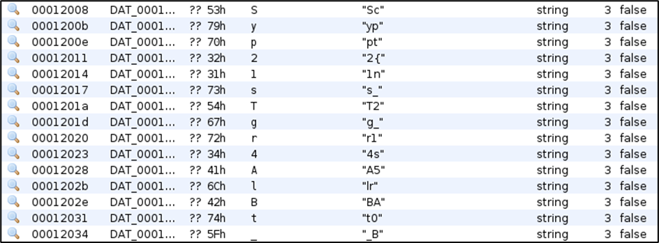
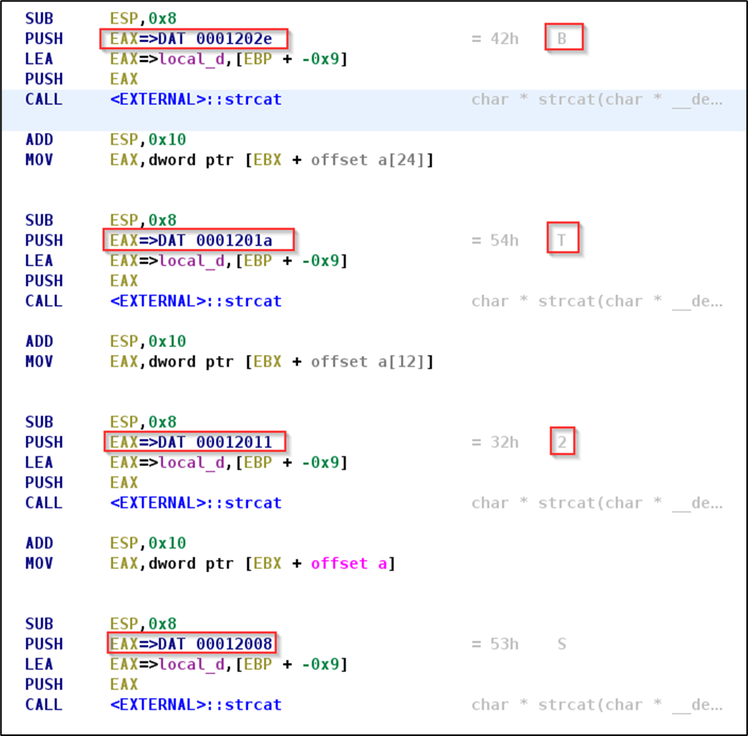
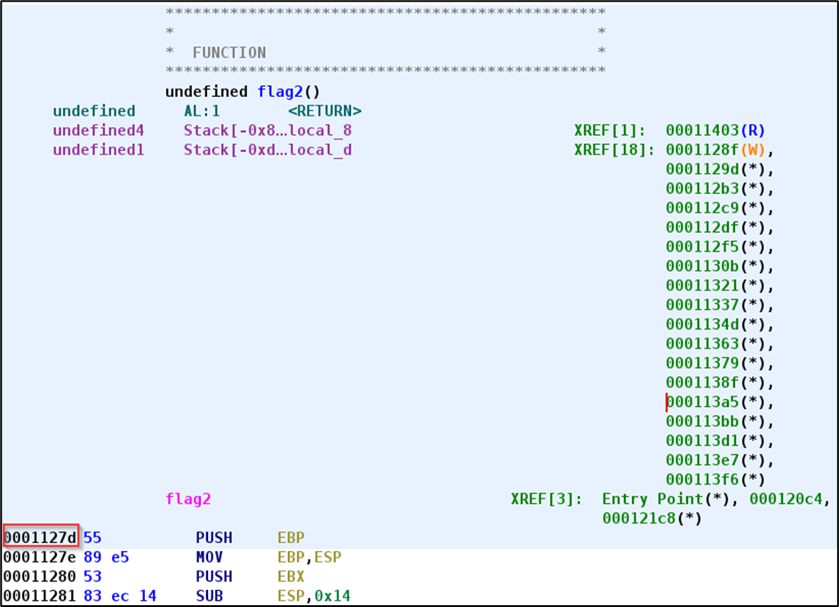
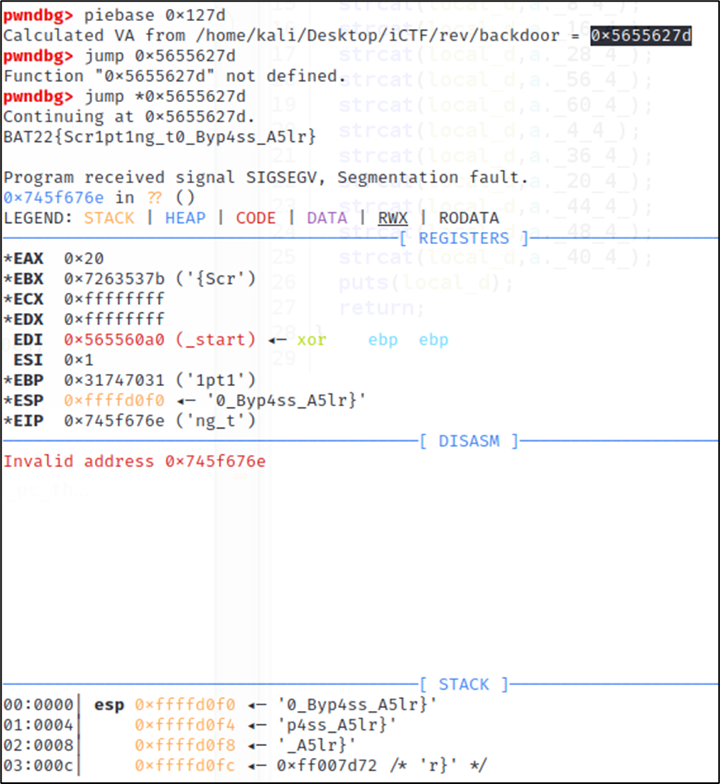

# **Randomness** 

> **Description:** Random Junk Breaks Everything... Ughh What is it called again? ASLR ???

### Basic File Checks

After downloading the file, check the file type and its data to get an overall idea about the characteristics and architecture that we are dealing with.

```
┌──(kali💀JesusCries)-[~/Desktop]
└─$ file backdoor            
backdoor: ELF 32-bit LSB pie executable, Intel 80386, version 1 (SYSV), dynamically linked, interpreter /lib/ld-linux.so.2, BuildID[sha1]=053fbfdb08d3ed00dd5445b7ab18f4053ca289c0, for GNU/Linux 3.2.0, not stripped
```

From the command above, some of the major takeaways are:

- ELF File Type.

- 32-bit.
- Least Significant Bit (LSB) executable.
- Functions name not stripped.

Since the challenge description mentioned something about ASLR. It’s worth checking the binary protection of the given file. 

```
┌──(kali💀JesusCries)-[~/Desktop]
└─$ checksec --file=backdoor 
[*] '/home/kali/Desktop/backdoor'
    Arch:     i386-32-little
    RELRO:    Partial RELRO
    Stack:    No canary found
    NX:       NX enabled
    PIE:      PIE enabled
```

PIE is enabled, which is an equivalent of ASLR. This means that the address will be randomized each time we execute the program.

### Static Analysis with Ghidra

Using Ghidra, we can check out some of the resolved function names from the binary. Some of the most notable functions are `main`, `shell`, `function1`, `flag1` and `flag2`. On the surface, and as suggested by the name, the binary is establishing connection to a remote host on a specified port via a backdoor planted prior. To understand what it’s doing entirely, we can deep dive into each of the individual function. 

The binary receives two arguments, which are the remote IP address and port respectively. It then jumps to `function` unconditionally along with the port number.

```
void main(undefined4 param_1,int param_2)

{
  function1(*(undefined4 *)(param_2 + 4));
  puts("Executed Normally");
  return;
}
```

`function1` then initialize a large buffer followed by a string copy operation of the port number. 

```
void function1(char *param_1)

{
  char local_200 [504];
  
  strcpy(local_200,param_1);
  return;
}
```

`shell` function on the other hand spawns an interactive shell, just like SSH! Nothing too interesting, but we’ll come back here if necessary.

```
void shell(void)

{
  system("/bin/sh");
  return;
}
```

`flag2` is a function that keeps concatenating strings repeatedly from data source to form a longer string, which could potentially be our flag. This means that the flag is stored in plaintext, but in a fragmented format, hence the need for concatenation.

```
void flag2(void)

{
  char local_d [5];
  
  local_d[0] = '\0';
  strcat(local_d,a._52_4_);
  strcat(local_d,a._24_4_);
  strcat(local_d,a._12_4_);
  strcat(local_d,a._0_4_);
  strcat(local_d,a._32_4_);
  strcat(local_d,a._8_4_);
  strcat(local_d,a._16_4_);
  strcat(local_d,a._28_4_);
  strcat(local_d,a._56_4_);
  strcat(local_d,a._60_4_);
  strcat(local_d,a._4_4_);
  strcat(local_d,a._36_4_);
  strcat(local_d,a._20_4_);
  strcat(local_d,a._44_4_);
  strcat(local_d,a._48_4_);
  strcat(local_d,a._40_4_);
  puts(local_d);
  return;
}
```

Therefore, we search for strings that comes in pair using `Ghidra`. This further justifies our theory as we can see the valid flag format appearing as `BA`, `T2` and `2{`. Rearrange this scrambled flag would be a pain in the ass.



For a better order of fragmented flags, we can go to the `.data` program tree in `Ghidra`.



**Flag:** `BAT22{Scr1pt1ng_t0_Byp4ss_A5lr}`

### **Dynamic Analysis with GDB**

From static code analysis, we learn that the `flag2` function was never called throughout the entire program, hence the function is unreachable. We can use GDB to halt the execution at `main` before it enters `function1` then control the EIP to point to `flag2`.

To bypass ASLR, we need to get the relative address or offset address of `flag2` function for debugging purpose.



Using the offset address, GDB can calculate the actual address of the function using PIE base. When the execution continues, we have our flag printed on the terminal after the `strcat()` and `puts()` functions are executed.



**Flag:** `BAT22{Scr1pt1ng_t0_Byp4ss_A5lr}`
