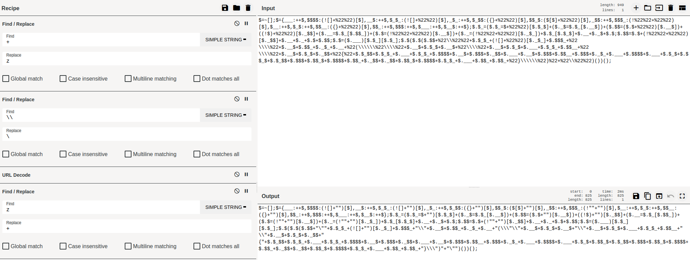

# DFIR 2

> **Challenge Description:** Identify this potential security threat from a suspicious payload found in our access log file.
>
> **Flag Format:** `ihack{MD5}`

### Solution

The `access.log` file contains an encoded payload wrapped within a script tag. Further analysis shows that the payload is URL encoded and JJEncoded.

```
/search.php?query=%3Cscript%3E$=~[];$={___:++$,$$$$:(![]+%22%22)[$],__$:++$,$_$_:(![]+%22%22)[$],_$_:++$,$_$$:({}+%22%22)[$],$$_$:($[$]+%22%22)[$],_$$:++$,$$$_:(!%22%22+%22%22)[$],$__:++$,$_$:++$,$$__:({}+%22%22)[$],$$_:++$,$$$:++$,$___:++$,$__$:++$};$.$_=($.$_=$+%22%22)[$.$_$]+($._$=$.$_[$.__$])+($.$$=($.$+%22%22)[$.__$])+((!$)+%22%22)[$._$$]+($.__=$.$_[$.$$_])+($.$=(!%22%22+%22%22)[$.__$])+($._=(!%22%22+%22%22)[$._$_])+$.$_[$.$_$]+$.__+$._$+$.$;$.$$=$.$+(!%22%22+%22%22)[$._$$]+$.__+$._+$.$+$.$$;$.$=($.___)[$.$_][$.$_];$.$($.$($.$$+%22\\%22%22+$.$_$_+(![]+%22%22)[$._$_]+$.$$$_+%22\\\\%22+$.__$+$.$$_+$._$_+$.__+%22(\\\\\\%22\\\\%22+$.__$+$.$_$+$.__$+%22\\\\%22+$.__$+$.$_$+$.___+$.$_$_+$.$$__+%22\\\\%22+$.__$+$.$_$+$._$$+%22{%22+$.$_$$+$.$_$_+$.___+$.$_$_+$.$$$$+$.__$+$.$$$+$._$$+$.___+$.__$+$.$$$+$.$$__+$.$$$+$._$_+$.___+$.$$$$+$.___+$.$_$+$.$$_$+$.$_$$+$.$$$+$.$$_$+$.$$$$+$.$$_+$._$$+$._$$+$.$$_$+$.$$$$+$.$_$_+$.___+$.$$_+$.$$_+%22}\\\\\\%22)%22+%22\\%22%22)())();%3C/script%3E
```

The plus sign `+` is a crucial character for `JJEncode`. Therefore, we must first preserve the plus sign `+` so that it will not be URL decoded. This can be done by substituting it with an alternative character. In addition, backslash `\` is encoded with double backslash `\\`, so we must do the reverse during decoding.

 

Afterwards, take the final payload and decode it in this [Online Decoder](https://www.53lu.com/tool/jjencode/).

```
alert("ihack{ba0af173017c720f05db7df633dfa066}")
```

**Flag:** `ihack{ba0af173017c720f05db7df633dfa066}`
