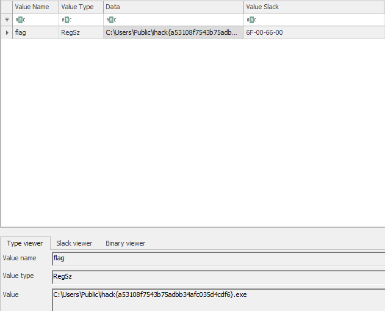

# DFIR 3

> **Challenge Description:** My computer have been infected with a malware. Every time I log in to my computer, the malware will be executed. Can you help me find the malware?
>  
> **Flag Format:** `ihack{MD5}`

Smells like a Registry Startup Persistence method. 

Open `NTUSER.dat` in `Registry Explorer` and navigate to `Root\Software\Microsoft\Windows\CurrentVersion\Run`.

**Flag:** `ihack{a53108f7543b75adbb34afc035d4cdf6}`
