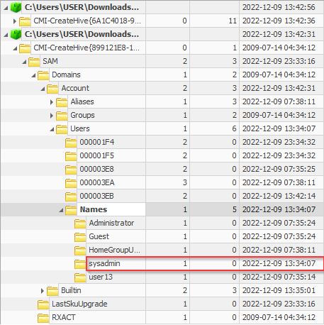

# Forensics

## I

> **Challenge Description:** Provide the MD5 hash of the memory image as the flag.
> 
> **Flag Format:** `ihack{MD5}`

### Solution
```
┌──(kali💀JesusCries)-[~/Desktop/iHack/volatility_2.6_lin64_standalone]
└─$ md5sum artefact.vmem 
2aff5e0bd33f622790c3db33f0798978  artefact.vmem
```

**Flag:** `ihack{2aff5e0bd33f622790c3db33f0798978}`

## II

> **Challenge Description:** There is an incident that happened. The SOC team has performed a memory dump on the infected PC. Based on the memory dump file, identify the suspicious process name used by the attacker.
>
> **Flag Format:** `ihack{name.ext}`

### Solution
Using the `pslist` plugin from `volatility`, we can list all the active processes. With `putty.exe` being the only non-Windows native binary, it is very likely that it is being abused by the attacker.

```
┌──(kali💀JesusCries)-[~/Desktop/iHack/volatility_2.6_lin64_standalone]
└─$ ./volatility_2.6_lin64_standalone -f artefact.vmem --profile Win7SP1x86 pslist                      
Volatility Foundation Volatility Framework 2.6
Offset(V)  Name                    PID   PPID   Thds     Hnds   Sess  Wow64 Start                          Exit   
---------- -------------------- ------ ------ ------ -------- ------ ------ ------------------------------ ---------------------
0x83db69e8 System                    4      0     91      598 ------      0 2022-12-09 23:35:07 UTC+0000                                 
0x85190468 smss.exe                224      4      3       35 ------      0 2022-12-09 23:35:07 UTC+0000                                 
0x857b6030 csrss.exe               304    296      9      540      0      0 2022-12-09 23:35:08 UTC+0000                                 
0x85830198 wininit.exe             340    296      3       76      0      0 2022-12-09 23:35:10 UTC+0000                                 
0x83e26630 csrss.exe               352    332      8      387      1      0 2022-12-09 23:35:10 UTC+0000                                 
0x858e3d40 winlogon.exe            380    332      8      135      1      0 2022-12-09 23:35:10 UTC+0000                                 
0x8591b2d0 services.exe            436    340     15      221      0      0 2022-12-09 23:35:11 UTC+0000                                 
0x8594da68 lsass.exe               460    340      9      959      0      0 2022-12-09 23:35:11 UTC+0000                                 
0x85950030 lsm.exe                 468    340     14      270      0      0 2022-12-09 23:35:11 UTC+0000                                 
0x8513f478 svchost.exe             572    436     12      371      0      0 2022-12-09 23:35:12 UTC+0000                                 
0x85152378 svchost.exe             632    436      9      311      0      0 2022-12-09 23:35:12 UTC+0000                                 
0x849132e8 sppsvc.exe              856    436      6      157      0      0 2022-12-09 07:35:14 UTC+0000                                 
0x84924258 svchost.exe             896    436     35      748      0      0 2022-12-09 07:35:16 UTC+0000                                 
0x8493d030 svchost.exe             920    436     40     1257      0      0 2022-12-09 07:35:16 UTC+0000                                 
0x84948030 svchost.exe             968    436     24     1056      0      0 2022-12-09 07:35:16 UTC+0000                                 
0x8494a490 svchost.exe            1036    436     23      553      0      0 2022-12-09 07:35:17 UTC+0000                                 
0x8495c2f0 svchost.exe            1060    436     26      714      0      0 2022-12-09 07:35:17 UTC+0000                                 
0x8492cd00 spoolsv.exe            1372    436     19      340      0      0 2022-12-09 07:35:18 UTC+0000                                 
0x849ef8f0 svchost.exe            1412    436     21      307      0      0 2022-12-09 07:35:18 UTC+0000                                 
0x848ee438 SearchIndexer.         1904    436     15      799      0      0 2022-12-09 07:35:24 UTC+0000                                 
0x84afcd40 taskhost.exe            332    436      9      213      1      0 2022-12-09 07:35:25 UTC+0000                                 
0x84afc3a0 dwm.exe                 772    896      6       73      1      0 2022-12-09 07:35:25 UTC+0000                                 
0x84ab9a58 explorer.exe            784    660     38     1014      1      0 2022-12-09 07:35:26 UTC+0000                                 
0x84b4e350 regsvr32.exe            100    784      0 --------      1      0 2022-12-09 07:35:28 UTC+0000   2022-12-09 07:35:29 UTC+0000  
0x84907d40 svchost.exe            1052    436     22      305      0      0 2022-12-09 07:36:57 UTC+0000                                 
0x84a48568 wmpnetwk.exe            608    436     22      524      0      0 2022-12-09 07:36:58 UTC+0000                                 
0x851237b0 svchost.exe            2300    436     11      315      0      0 2022-12-09 07:37:20 UTC+0000                                 
0x84aad380 svchost.exe            3556    436     11      363      0      0 2022-12-09 07:38:08 UTC+0000                                 
0x84af1030 calc.exe               2696    784      4       71      1      0 2022-12-09 13:22:07 UTC+0000                                 
0x83f07030 taskmgr.exe             768    784      7      115      1      0 2022-12-09 13:22:24 UTC+0000                                 
0x84804030 iexplore.exe           3768    784     15      397      1      0 2022-12-09 13:22:31 UTC+0000                                 
0x84ba02b0 iexplore.exe           2900   3768     14      389      1      0 2022-12-09 13:22:32 UTC+0000                                 
0x84688490 mmc.exe                3116    784     15      273      1      0 2022-12-09 13:22:43 UTC+0000                                 
0x83f280f8 audiodg.exe            1000    968     10      165      0      0 2022-12-09 13:26:02 UTC+0000                                 
0x84954b20 wmplayer.exe           3240   1596     18      546      1      0 2022-12-09 13:26:20 UTC+0000                                 
0x84a18960 mmc.exe                2040    784     15      297      1      0 2022-12-09 13:31:27 UTC+0000                                 
0x84679bc0 putty.exe              1732    784      6      137      1      0 2022-12-09 13:33:48 UTC+0000                                 
0x84943b00 cmd.exe                2384   1732      1       26      1      0 2022-12-09 13:33:56 UTC+0000                                 
0x84afd030 conhost.exe             932    352      3       49      1      0 2022-12-09 13:33:56 UTC+0000                                 
0x857d9550 cmd.exe                 960    784      1       22      1      0 2022-12-09 13:36:58 UTC+0000                                 
0x84693568 conhost.exe            3860    352      3       52      1      0 2022-12-09 13:36:58 UTC+0000                                 
0x83fbabf8 csrss.exe              3696   1628      8      200      2      0 2022-12-09 13:42:13 UTC+0000                                 
0x83fafc80 winlogon.exe           3640   1628      6      117      2      0 2022-12-09 13:42:13 UTC+0000                                 
0x83fa8d40 csrss.exe              3376   3204      7       81      3      0 2022-12-09 13:42:28 UTC+0000                                 
0x846425c8 SearchProtocol         3236   1904     13      431      0      0 2022-12-09 13:42:28 UTC+0000                                 
0x8462f770 winlogon.exe           3292   3204      6      103      3      0 2022-12-09 13:42:28 UTC+0000                                 
0x84c00678 LogonUI.exe            2832   3292      8      174      3      0 2022-12-09 13:42:29 UTC+0000                                 
0x84c14998 SearchFilterHo         2996   1904      8      159      0      0 2022-12-09 13:42:30 UTC+0000                                 
0x84c32d40 taskhost.exe            944    436      9      161      2      0 2022-12-09 13:42:31 UTC+0000                                 
0x84c3f030 rdpclip.exe            1020   1060     10      168      2      0 2022-12-09 13:42:31 UTC+0000                                 
0x84624160 userinit.exe           3316   3640      5       50      2      0 2022-12-09 13:42:31 UTC+0000                                 
0x846a4d40 dwm.exe                2800    896      5       70      2      0 2022-12-09 13:42:31 UTC+0000                                 
0x83f47450 explorer.exe           3728   3316     33      748      2      0 2022-12-09 13:42:32 UTC+0000                                 
0x858ded40 regsvr32.exe            152   3728      0 --------      2      0 2022-12-09 13:42:33 UTC+0000   2022-12-09 13:42:35 UTC+0000  
0x84653030 SearchProtocol         3356   1904      7      256      2      0 2022-12-09 13:42:45 UTC+0000
```

**Flag:** `ihack{putty.exe}`

## III

> **Challenge Description:** Identify process ID (PID) of the suspicious process.
>
> **Flag Format:** `ihack{PID}`

### Solution
```
Offset(V)  Name                    PID   PPID   Thds     Hnds   Sess  Wow64 Start                          Exit   
---------- -------------------- ------ ------ ------ -------- ------ ------ ------------------------------ ---------------------
0x84679bc0 putty.exe              1732    784      6      137      1      0 2022-12-09 13:33:48 UTC+0000   
```

**Flag:** `ihack{1732}`

## IV

> **Challenge Description:** The SOC analyst confirmed that the infected PC is actively making an connection to the IP address of the attacker's C2 server. Identify the IP address of the C2 server.
>
> **Flag Format:** `ihack{IP}`

### Solution
To look for inbound and outbound network connections, use the `netscan` plugin. `putty.exe` is reaching out to the foreign address of `139.59.122.20:4445`.

```
┌──(kali💀JesusCries)-[~/Desktop/iHack/volatility_2.6_lin64_standalone]
└─$ ./volatility_2.6_lin64_standalone -f artefact.vmem --profile Win7SP1x86 netscan | grep "ESTABLISHED"
Volatility Foundation Volatility Framework 2.6
Offset(P)          Proto    Local Address                  Foreign Address      State            Pid      Owner          Created
0x1fcd6428         TCPv4    192.168.74.173:3389            192.168.74.171:53017 ESTABLISHED      1060     svchost.exe    
0x1fd87750         TCPv4    192.168.74.173:49262           139.59.122.20:4445   ESTABLISHED      1732     putty.exe  
```

**Flag:** `ihack{139.59.122.20}`

## V

> **Challenge Description:** There is an additional user in the compromised host that was created by the attacker. Can you spot the new user from the given memory dump file?
>
> **Flag Format:** `ihack{username}`

### Solution
Continuing from the suspicious process of `putty.exe`, dump the process using `memdump` plugin and grep for `net user`, which is the typical command for administrators to add new users on the local machine.

```
┌──(kali💀JesusCries)-[~/Desktop/iHack/volatility_2.6_lin64_standalone]
└─$ ./volatility_2.6_lin64_standalone -f artefact.vmem --profile Win7SP1x86 memdump -p 1060 -D .
Volatility Foundation Volatility Framework 2.6
************************************************************************
Writing svchost.exe [  1060] to 1060.dmp

┌──(kali💀JesusCries)-[~/Desktop/iHack/volatility_2.6_lin64_standalone]
└─$ strings 1732.dmp | grep "net user"       
4net user sysadmin sysadmin123 /add
4net user sysadmin sysadmin123 /add
4net user sysadmin sysadmin123 /add
net user sysadmin
```

**Flag:** `ihack{sysadmin}`

## VI

> **Challenge Description:** A user complains that his session is being hijacked due to an active RDP connection to his PC. Can you identify the IP address that is establishing the RDP connection?
>
> **Flag Format:** `ihack{IP}`

### Solution
From the previous question, there is another suspicious process that is highly correlated with RDP connection. 

```
Offset(V)  Name                    PID   PPID   Thds     Hnds   Sess  Wow64 Start                          Exit   
---------- -------------------- ------ ------ ------ -------- ------ ------ ------------------------------ ---------------------
0x84c3f030 rdpclip.exe            1020   1060     10      168      2      0 2022-12-09 13:42:31 UTC+0000  
```

From the list of established connection, there is no active connection with `rdpclip.exe` as the process owner. However, the parent ID (PPID) of `rdpclip.exe` is communicating with another foreign IP of `192.168.74.171`.

```
Offset(P)          Proto    Local Address                  Foreign Address      State            Pid      Owner          Created
0x1fcd6428         TCPv4    192.168.74.173:3389            192.168.74.171:53017 ESTABLISHED      1060     svchost.exe    
```

**Flag:** `ihack{192.168.74.171}`

## VII

> **Challenge Description:** Timestamp for when the attacker create a new user on the victim's PC.
>
> **Flag Format:** `ihack{year-month-day hour:min:second}`

### Solution
The Windows registry hive contains artifacts related to user accounts and secrets. Using `hivelist`, we can list all the registry hives.

```
┌──(kali💀JesusCries)-[~/Desktop/iHack/volatility_2.6_lin64_standalone]
└─$ ./volatility_2.6_lin64_standalone -f artefact.vmem --profile Win7SP1x86 hivelist                            
Volatility Foundation Volatility Framework 2.6
Virtual    Physical   Name
---------- ---------- ----
0x8780c008 0x1a520008 [no name]
0x8781c008 0x1a8ae008 \REGISTRY\MACHINE\SYSTEM
0x878429c8 0x1aa169c8 \REGISTRY\MACHINE\HARDWARE
0x8b61a008 0x1916a008 \??\C:\Windows\ServiceProfiles\LocalService\NTUSER.DAT
0x8b7ed008 0x18282008 \??\C:\Windows\ServiceProfiles\NetworkService\NTUSER.DAT
0x8b90b008 0x1819c008 \SystemRoot\System32\Config\SAM
0x8bb249c8 0x16d8f9c8 \Device\HarddiskVolume1\Boot\BCD
0x8bb2d830 0x16fe3830 \SystemRoot\System32\Config\SOFTWARE
0x8cc1e008 0x1c02a008 \??\C:\Users\user13\ntuser.dat
0x8ccff5b0 0x0a4885b0 \??\C:\Users\user13\AppData\Local\Microsoft\Windows\UsrClass.dat
0x8ee3b648 0x13930648 \SystemRoot\System32\Config\DEFAULT
0x8f2823d8 0x1cbb93d8 \??\C:\Users\sysadmin\AppData\Local\Microsoft\Windows\UsrClass.dat
0x8f286008 0x1b946008 \SystemRoot\System32\Config\SECURITY
0x93eb2008 0x13b55008 \??\C:\System Volume Information\Syscache.hve
0x96a084b8 0x040c84b8 \??\C:\Users\sysadmin\ntuser.dat
```

There is a particular registry hive that governs user information. We can dump the SAM database using `dumpregistry` and analyze it externally.

```
┌──(kali💀JesusCries)-[~/Desktop/iHack/volatility_2.6_lin64_standalone]
└─$ ./volatility_2.6_lin64_standalone -f artefact.vmem --profile Win7SP1x86 dumpregistry -o 0x8b90b008 -D .
Volatility Foundation Volatility Framework 2.6
**************************************************
Writing out registry: registry.0x8b90b008.SAM.reg

**************************************************
```

Using `Registry Explorer`, we can extract the timestamp for user creation from the path `SAM\Domains\Account\Users\Names\sysadmin`.



**Flag:** `ihack{2022-12-09 13:34:07}`
