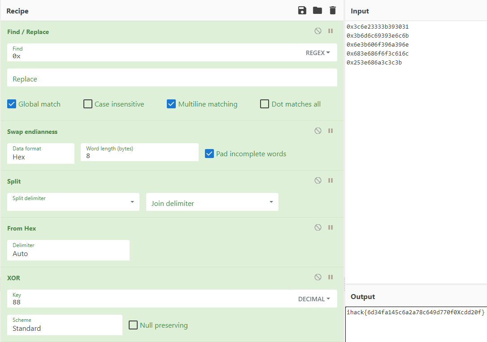

# Rev-01

> **Challenge Description:** Reverse and provide me the flag. 
>
> **Flag Format:** `ihack{MD5}`

Decompile the given binary in `Ghidra` and navigate to the function `FUN_001011b9`:

```
undefined8 FUN_001011b9(void)

{
  int iVar1;
  long lVar2;
  size_t sVar3;
  char local_98 [48];
  undefined8 local_68;
  undefined8 local_60;
  undefined8 local_58;
  undefined8 local_50;
  undefined8 local_48;
  int local_18;
  byte local_11;
  int local_10;
  int local_c;
  
  lVar2 = ptrace(PTRACE_TRACEME,0,0,0);
  if (lVar2 == -1) {
    puts("Nope, don\'t do that here.");
  }
  else {
    local_c = 0;
    putchar(10);
    puts("  ,---------------------------,");
    puts("  |  /---------------------   |");
    puts("  | | Welcome to iHack2022! | |");
    puts("  | |  \t    \t\t    | |");
    puts("  | |       \t \t    | |");
    puts("  | |                       | |");
    puts("  | |                       | |");
    puts("  |  _____________________ /  |");
    puts("  |___________________________|");
    puts("  ,---_____     []     _______/------,");
    puts(" /         /______________           /|");
    puts("/___________________________________ /  | ___");
    puts("|                                   |   |    )");
    puts("|  _ _ _                 [-------]  |   |   (");
    puts("|  o o o                 [-------]  |  /    _)_");
    puts("|__________________________________ |/     /  /");
    puts("/-------------------------------------/|      ( )/");
    puts("/-/-/-/-/-/-/-/-/-/-/-/-/-/-/-/-/-/-/-/ /");
    puts("/-/-/-/-/-/-/-/-/-/-/-/-/-/-/-/-/-/-/-/ /");
    puts("~~~~~~~~~~~~~~~~~~~~~~~~~~~~~~~~~~~~~~~");
    printf("Enter the flag = ");
    fgets(local_98,0x28,stdin);
    local_68 = 0x3c6e23333b393031;
    local_60 = 0x3b6d6c69393e6c6b;
    local_58 = 0x6e3b606f396a396e;
    local_50 = 0x683e686f6f3c616c;
    local_48 = 0x253e686a3c3c3b;
    local_11 = 0x58;
    sVar3 = strlen((char *)&local_68);
    local_18 = (int)sVar3;
    for (local_10 = 0; local_10 < local_18; local_10 = local_10 + 1) {
      *(byte *)((long)&local_68 + (long)local_10) =
           *(byte *)((long)&local_68 + (long)local_10) ^ local_11;
    }
    iVar1 = strcmp(local_98,(char *)&local_68);
    if (iVar1 == 0) {
      local_c = 1;
    }
    puts("\nChecking Flag...\n");
    sleep(5);
    if (local_c != 0) {
      puts("Good job!");
                    /* WARNING: Subroutine does not return */
      exit(0);
    }
    puts("Failed!");
  }
  return 0;
}
```

The hardcoded flag stored in `local_68` up until `local_48` is XOR encrypted with `local_11` as the key during the loop.

By using `CyberChef`, change the hex representation to Little-Endian before XORing the encoded flag by `0x58`.



**Flag:** `ihack{6d34fa145c6a2a78c649d770f0Xcdd20f}`
